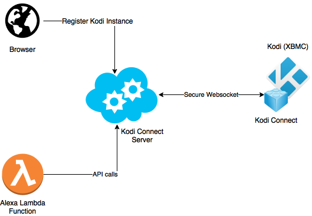

# Kodi Alexa Video Skill

Implements [Alexa Video Skill](https://developer.amazon.com/docs/video/understand-the-video-skill-api.html)
Example [Youtube](https://www.youtube.com/watch?v=BTgooV_YEvg)

Connects to the Kodi Connect Server to:
 - Discover all registered Kodi instances
 - Send commands to connected Kodi instances

## Beta testing
At the moment, the skill is not certified, and is in Beta testing, so you have to contact me (send me your Amazon/Alexa email), in order to be included in.

Also note, that Amazon has made Video Skills available only to US, UK, and DE countries. So you will have to switch country in Amazon settings in order to be able to use this skill.

## Working features
*as of version 0.1.8 of the addon*
- Search and Display [Examples](https://developer.amazon.com/docs/video/video-skill-testing-guide.html#search-content)
  - This will display a list of matched Movies/TVshows
- Search and Play [Examples](https://developer.amazon.com/docs/video/video-skill-testing-guide.html#play-content)
- Control playback [Examples](https://developer.amazon.com/docs/video/video-skill-testing-guide.html#control-playback)
- Seeking [Examples](https://developer.amazon.com/docs/device-apis/alexa-seekcontroller.html#adjustseekposition)
- [Setting](https://developer.amazon.com/docs/device-apis/alexa-speaker.html#setvolume) and [Adjusting](https://developer.amazon.com/docs/device-apis/alexa-speaker.html#adjustvolume) volume, and [muting, unmuting](https://developer.amazon.com/docs/device-apis/alexa-speaker.html#setmute)
- Turning On/Off - "Alexa, turn On/Off <device_name>" (Device name is taken from KodiConnect page)
  - This is only available for devices with CEC capability, like RPi, etc. (it checks for `cec-client` binary)

**Note**: If updating Addon which introduces new features, you need to relink the Kodi device in Alexa app. Just unlink the device, and go through discovery again. This is because new versions of Addon now report supported features, to ensure backward compatibility, and seamless user experience. This should be the first step, if some of the features is not working for you.

## Installation
- First you need to create account on Kodi Connect Server
  - See installation steps [here](https://github.com/kodi-connect/kodi-connect/blob/master/tutorial/readme.md)
- After that, you have to install Kodi Connect Addon on your Kodi instance
  - See installation steps [here](https://github.com/kodi-connect/kodi-connect-addon/blob/master/tutorial/readme.md)
- Before enabling the Alexa skill, you need to apply for the Beta test
  - See installation steps [here](https://github.com/kodi-connect/kodi-connect/blob/master/tutorial-alexa/readme.md)
- Next step is enabling Kodi Video Skill on your Alexa
  - See installation steps [here](tutorial/readme.md)

## Architecture overview

## Donation
If you want to buy me a beer :) 

