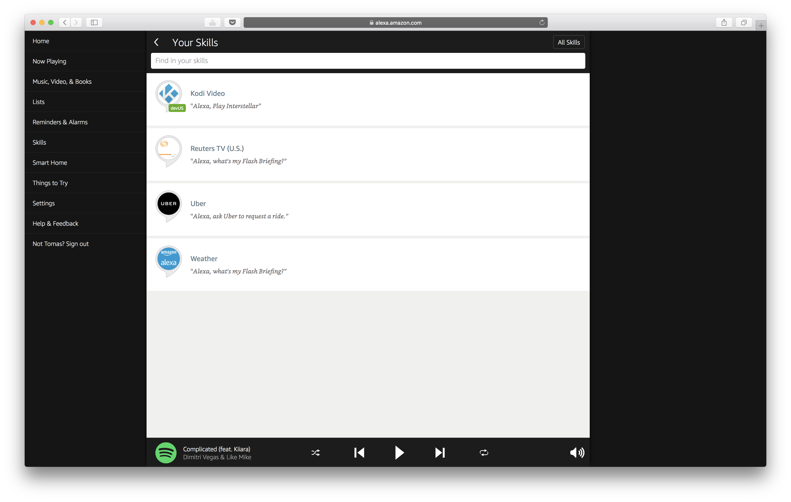
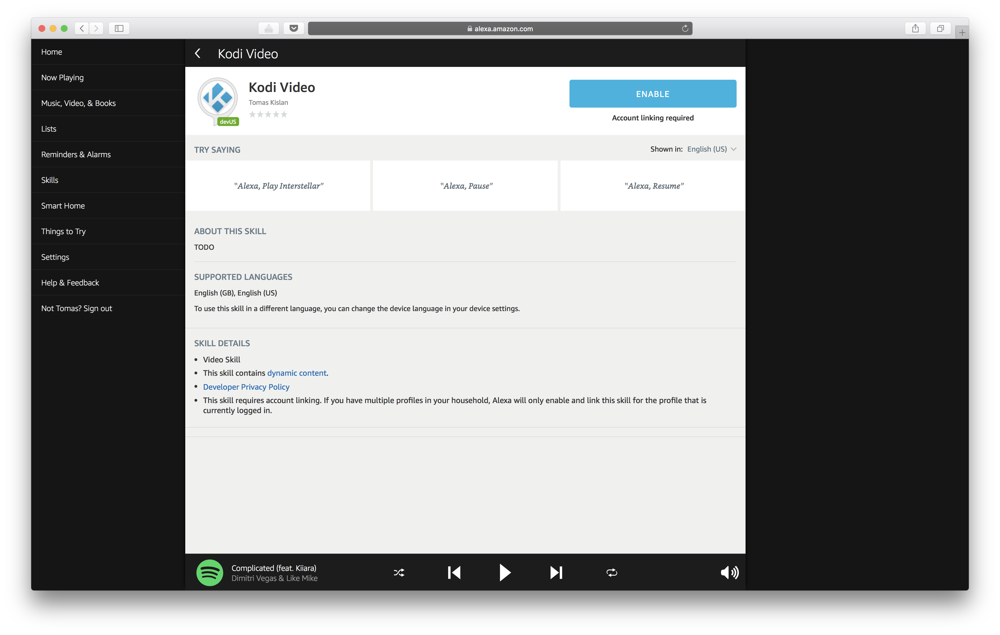
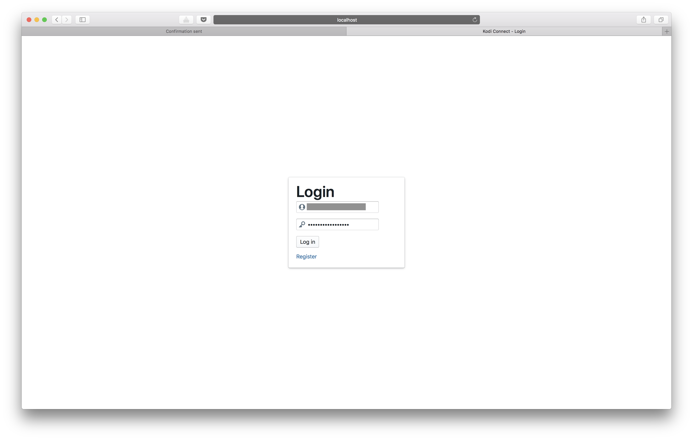
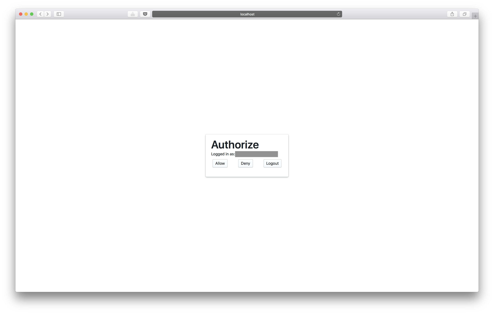
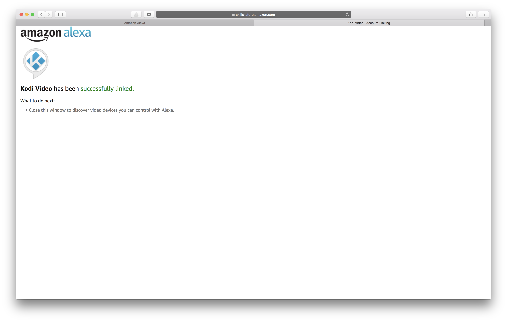
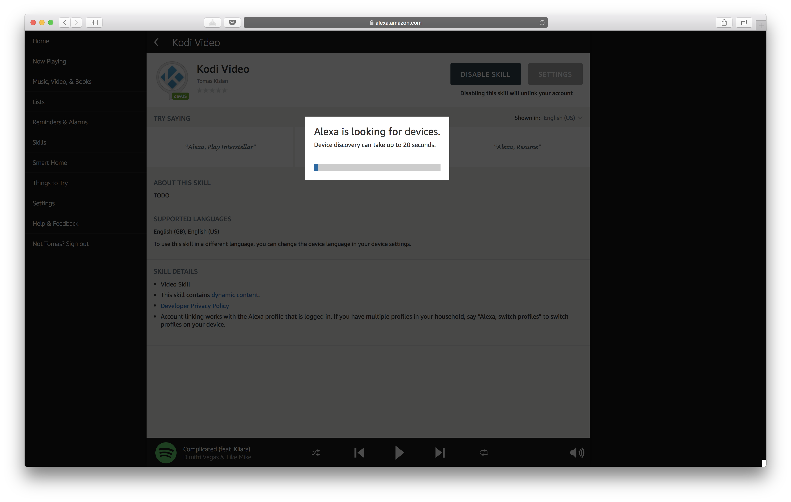
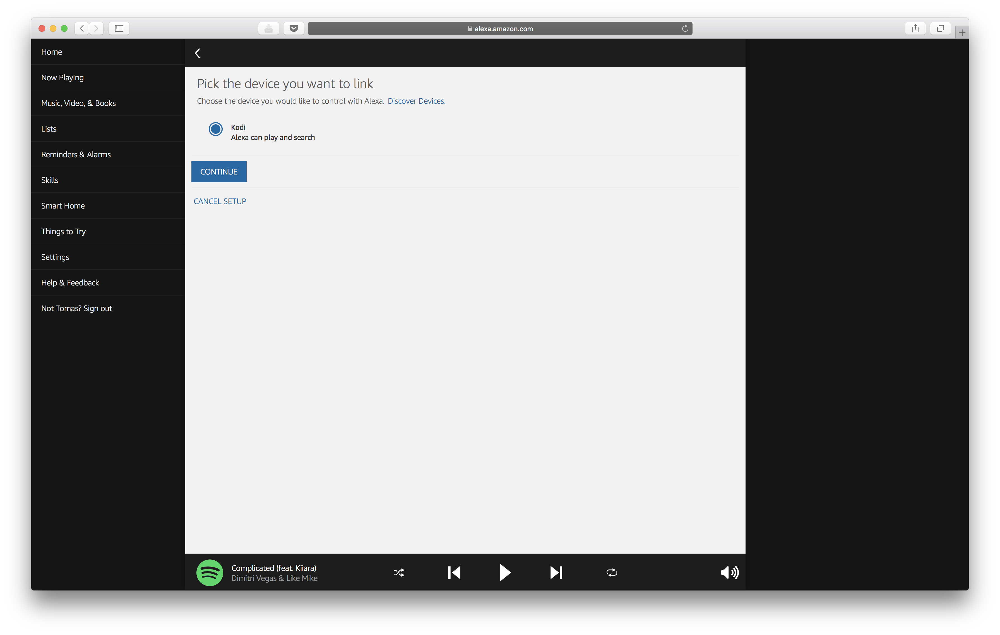
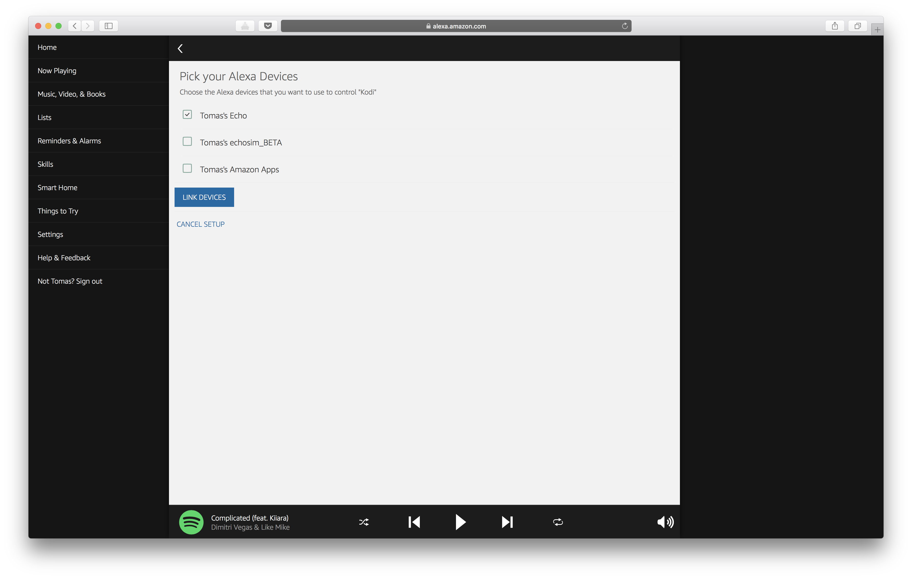
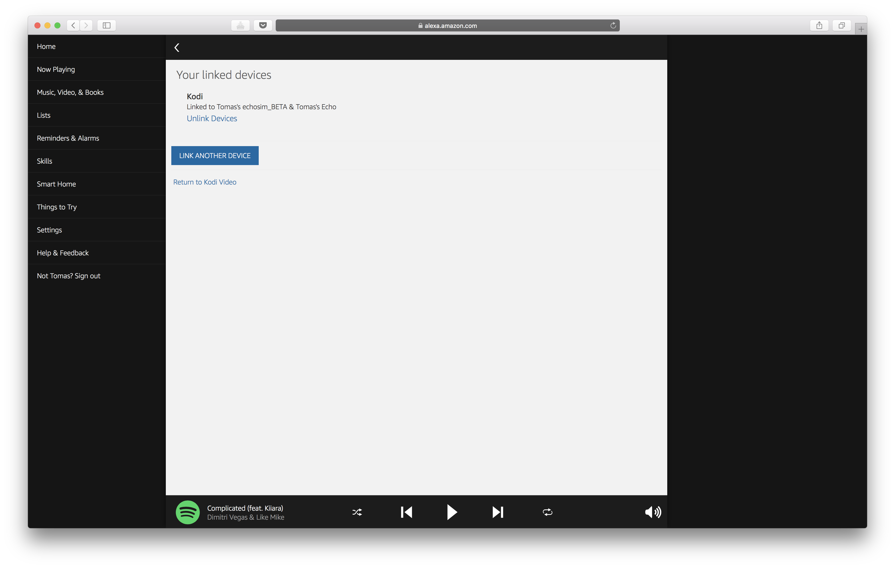
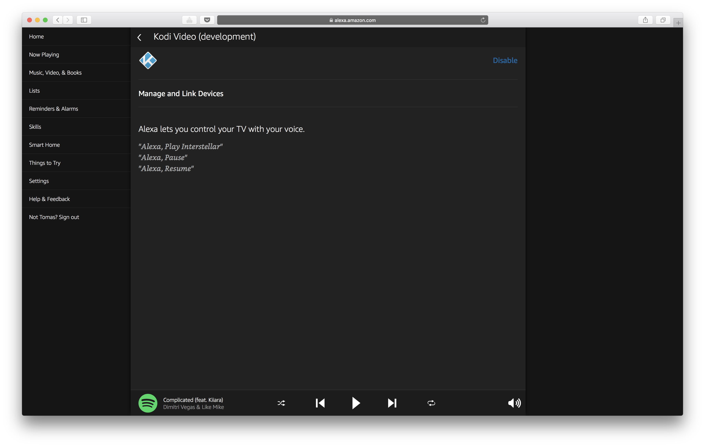

## Enable Alexa skill

Navigate to [https://alexa.amazon.com](https://alexa.amazon.com)

Click Kodi Video under **Your skills**.

Click on **Enable** button, to start Skill account linking.

Enter your credentials for Kodi Connect.

Press **Allow** button, to authorize Amazon with Kodi Connect Server.

Confirmation page will open after that, which you can close, and return to previous page.

Device discovery will start automatically, which should not take more than few seconds.

After discovery, at least one Kodi instance should be visible in list. Pick one to connect it to the Echo.

Pick which Echo devices can control the Kodi instance.

This page just shows you the list of connected Kodi instances. Just click the last link, to go back to skill overview.

All is set up now, and you can start asking Alexa to play movies and/or tv shows on your Kodi instance.

